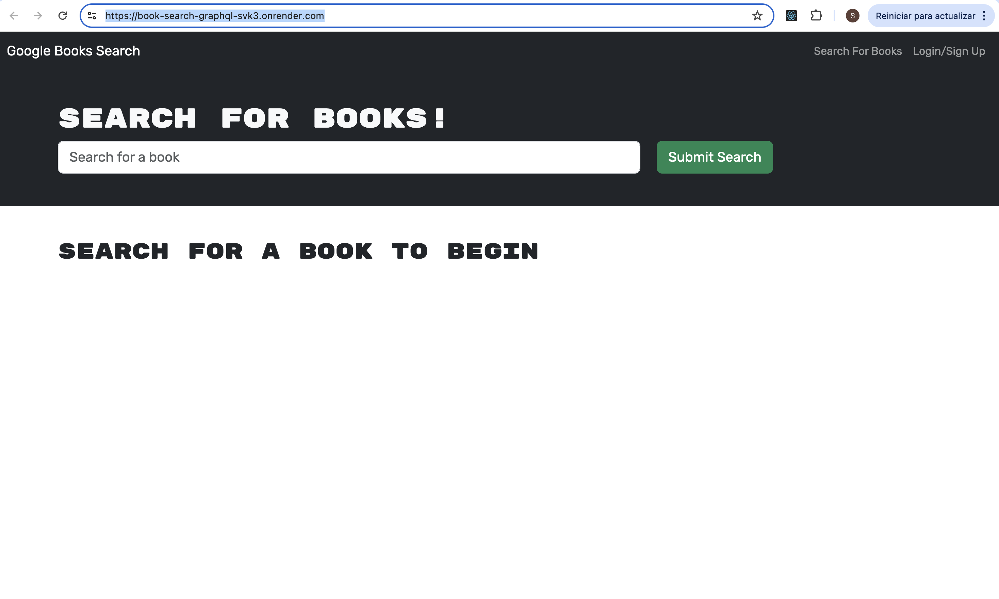

# Book Search Engine

## Description

This project is a Book Search Engine built with the MERN stack. The application allows users to search for books via the Google Books API, save their favorite books, and view their saved books. The application has been refactored to use a GraphQL API built with Apollo Server, replacing the existing RESTful API.

## Table of Contents

- [Description](#description)
- [Installation](#installation)
- [Deployment](#deployment)
- [Screenshot](#screenshot)
- [Technologies Used](#technologies-used)
- [Features](#features)
- [License](#license)

## Installation

To install and run the application locally, follow these steps:

1. Clone the repository:

   ```bash
   git clone https://github.com/StgoWF/book-search-graphql.git
   ```

2. Navigate to the project directory:
    ```bash
    cd book-search-graphql
    ```
3. Install the dependencies:
    ```bash
    npm install
    cd client
    npm install
    cd ..
    cd server
    npm install
    cd ..
    ```
4. Set up the environment variables. Create a .env file in the root directory and add the following:
    ```bash
    MONGODB_URI=your_mongodb_uri
    JWT_SECRET=your_jwt_secret
    ```
6. Start the server:
   ```bash
   npm start
   ```

## Deployment

The application is deployed on Render. You can access the live application at:

[https://book-search-graphql-svk3.onrender.com/](https://book-search-graphql-svk3.onrender.com/)

## Screenshot



## Technologies Used

- React
- Node.js
- Express.js
- MongoDB
- Apollo Server
- GraphQL

## Features

- Search for books using the Google Books API
- Save books to your account
- View saved books
- Remove books from your saved list

## License

This project is licensed under the MIT License.
